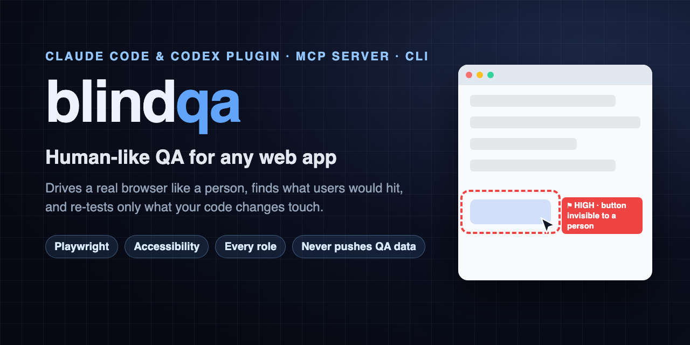

<div align="center">



# blindqa — human-like QA testing for any web app

**An AI QA testing plugin for Claude Code and Codex, an MCP server and a CLI — built on Playwright.**
It drives your app in a real browser the way a person does, finds the bugs a real user would hit,
and re-tests only what your code changes touch. No AI model in the test loop: runs cost zero tokens.

[](https://github.com/DevZonayed/blindqa/actions/workflows/ci.yml)
[](https://github.com/DevZonayed/blindqa/releases)
[](LICENSE)
[](https://nodejs.org)
[](#claude-code)
[](#codex)
[](#command-line--any-mcp-client)
[](https://playwright.dev)
[](https://github.com/DevZonayed/blindqa/stargazers)

[Install](#install) · [What it finds](#what-it-finds) · [How it works](#how-it-works) · [Re-test what changed](#re-test-only-what-changed) · [Browsers](#one-browser-setting-per-machine) · [FAQ](#faq) · [Docs](https://devzonayed.github.io/blindqa/)

</div>

---

blindqa is an **automated, human-like QA tester** for web applications — exploratory testing, end-to-end
testing and regression re-tests in one tool. Instead of checking what is in the DOM, it checks what a person
can actually see and use: it scrolls with the mouse wheel, moves a visible cursor, clicks only controls a
person could see and reach, signs in as every role, and opens every menu, dropdown and form. It works as a
**Claude Code plugin**, a **Codex plugin**, a **Model Context Protocol (MCP) server** for any AI agent, and a
plain **command-line tool**. Your coding agent sets it up and verifies what it finds; scripts do all of the
testing, so a run costs no model tokens and nothing about your app is sent to an AI.

## Highlights
- **End-to-end testing like a real user** — every screen, for every role, on desktop and phone width, built on [Playwright](https://playwright.dev).
- **Visual and accessibility checks a DOM test misses** — covered, clipped, transparent or off-screen controls, scroll-locked pages, unlabeled buttons, low contrast, tiny tap targets.
- **Re-test only what changed** — a script-built code index maps git changes to the pages they affect and re-runs just those crawls and journeys: NEW / FIXED / STILL.
- **Read-only by default** — crawls block every write request at the network level; journeys and "act mode" that change data are opt-in.
- **Never pushes your QA data** — everything lives in one `.blindqa/` folder that git ignores and a pre-push hook guards.
- **Any browser setup** — a local window, headless CI, your own Chrome over CDP, an [n.eko](https://github.com/m1k1o/neko) container your team can watch, or Orca's built-in browser.
- **Zero tokens per run** — scripts drive the browser, run every check and make every judgment call (what a button will do, whether a submit worked); your agent only sets up, writes journeys and verifies what's new.

## What it finds
Real examples from its checks — the kinds of bugs users hit and unit tests don't:
- a button that is on the page but invisible (`opacity: 0`), covered by a toast or sticky header, or cut off by its container
- a page that stays scroll-locked after a dialog closes, so the rest of the form can't be reached
- a ⋯ row menu that opens off-screen, or a "New …" form whose empty submit shows no error at all
- buttons a role can see but the server refuses (403), and permission rules that differ between UI and API
- forms that accept nonsense (negative quantities, invalid tax numbers, a due date before the issue date)
- error messages shown as raw developer text, or behind the dialog that caused them
- navigation that breaks at phone width (no menu button, a menu that won't close with Escape, sideways scrolling)

## Install

Requirements: **Node.js 20+** and **git**. The first run installs the plugin's dependencies and (for the
default browser mode) Chromium for Playwright.

### Claude Code
In Claude Code:
```
/plugin marketplace add DevZonayed/blindqa
/plugin install blindqa@blindqa
```
or from a terminal:
```
claude plugin marketplace add DevZonayed/blindqa
claude plugin install blindqa@blindqa
```
Restart Claude Code, then ask: *"Set up blindqa for this repo."* You get the `blindqa` MCP server
(`blindqa_*` tools), six skills and the `blindqa-verifier` agent. No API keys to set.

Update: `claude plugin marketplace update blindqa && claude plugin update blindqa@blindqa`
· Remove: `claude plugin uninstall blindqa@blindqa && claude plugin marketplace remove blindqa`

### Codex
```
codex plugin marketplace add DevZonayed/blindqa
codex plugin add blindqa@blindqa
```
Start a new Codex session and ask the same way.

Update: `codex plugin marketplace upgrade` (then `codex plugin add blindqa@blindqa` again)
· Remove: `codex plugin remove blindqa@blindqa && codex plugin marketplace remove blindqa`

### Command line / any MCP client
```
git clone https://github.com/DevZonayed/blindqa.git && cd blindqa && npm install
node bin/blindqa.mjs setup            # Chromium for Playwright, once
node bin/blindqa.mjs help
```
MCP server on stdio for any other client (Cursor, Windsurf, VS Code, your own agent):
`node /path/to/blindqa/mcp/launch.mjs`.

More: [docs/INSTALL.md](docs/INSTALL.md) — first steps on a new machine, sub-agent model settings.

## Quick start
In Claude Code or Codex, just ask — the skills know the order:
> *"Set up blindqa for this repo."* → *"Crawl every role."* → *"Write a journey for invoicing."* →
> *"I changed some files — re-test."* → *"Which findings are real?"*

The same from a terminal:
```
blindqa machine detect                 # which browser this machine should use
blindqa init <github-link | folder>    # creates .blindqa/ and the never-push guard
blindqa doctor                         # everything green?
blindqa crawl --role ADMIN --bg        # read-only crawl, in the background
blindqa summary                        # short, grouped findings
blindqa index                          # baseline for re-tests
```

## How it works
| Decision | Who decides | Cost |
|---|---|---|
| Driving the browser; visibility, scroll, contrast, size checks; write blocking; console and HTTP errors; code index; change impact; run comparison | **scripts** | machine time |
| Judgment calls: error or blank screens, raw ids and codes shown to users, button names a screen reader can't tell apart, what a control will do, what a field expects, whether a submit worked | **scripts** ([`src/judge.mjs`](src/judge.mjs)) | machine time |
| Setting up the project, writing journeys, verifying new high-severity findings, writing the report | **your coding agent** | model tokens — only here |

Three ways to test:
- **Crawl** — read-only, one top-to-bottom pass per page for a role: every control audited, menus and
  dropdowns opened, "New/Add" forms checked with an empty submit, tabs and sections in order.
- **Journeys** — short scripts for real workflows (sign in, create data, switch roles, check figures),
  written once and reused on every run.
- **Act mode** — uses every option on every screen with valid data and records what each one did
  (test environments only).

## Re-test only what changed
After the first full run, a change costs minutes of machine time and one short report:
```
blindqa changes                     # changed files → which pages they reach (through imports and API calls)
blindqa retest --run-tests          # re-run only the affected crawls and journeys
```
The code index reads every file by script in well under a second (page routes for Next.js, React Router,
SvelteKit, Nuxt, Remix; endpoints for NestJS, Express, Fastify, Next.js route handlers; visible labels; API
calls; imports through tsconfig aliases and monorepo packages). Comparisons count only the screens that
were re-visited, so a partial re-test never claims untouched screens are fixed. Global changes (layout,
global CSS, config, dependencies, migrations) trigger a full re-test. Details: [docs/RETEST.md](docs/RETEST.md).

## One browser setting per machine
| Mode | Use it for |
|---|---|
| `local` | a desktop: one visible Chromium window that stays open, robot cursor included |
| `headless` | CI and servers without a display |
| `cdp` | your own Chrome (or Browserless) over the DevTools protocol, in an isolated context |
| `neko` | a shared browser in an n.eko container your team can watch live — compose template included |
| `orca` | Orca's built-in browser (experimental) — or run blindqa in an Orca terminal in `local` mode |

`blindqa machine detect` suggests one; setup for each: [docs/BROWSERS.md](docs/BROWSERS.md).

## Your QA data never reaches a git remote
Logins, saved sessions, screenshots and reports live in `<repo>/.blindqa/`, which (1) ignores itself,
(2) is listed in `.git/info/exclude`, and (3) is guarded by a `pre-push` hook that refuses any push
containing it — even after `git add -f`. blindqa never edits your tracked files, and repos it clones for
testing can't push at all. Check with `blindqa guard`. Details: [docs/LAYOUT.md](docs/LAYOUT.md).

## Commands
| CLI | MCP tool | What |
|---|---|---|
| `machine detect\|set\|show\|test` | `blindqa_machine` | this computer's browser mode |
| `init <src>` | `blindqa_init` | clone (push disabled) or adopt a repo; create `.blindqa/`; install the guard |
| `guard [--install]` / `layout` | `blindqa_guard` / `blindqa_layout` | never-push checks / folder layout |
| `doctor` | `blindqa_doctor` | browser, guard, app, roles, credentials, mail |
| `setup` | `blindqa_setup` | Chromium for Playwright |
| `crawl --role R [--phone] [--only re] [--start /path] [--headless] [--bg]` | `blindqa_crawl` | read-only crawl |
| `act --role R` | `blindqa_act` | use every option (real writes; test environments only) |
| `journey <file>` | `blindqa_journey` | run a journey |
| `index` / `changes [--since ref]` / `retest [--run-tests] [--accept]` | `blindqa_index` / `blindqa_changes` / `blindqa_retest` | code index, change impact, targeted re-test |
| `jobs` / `job <id>` / `stop <id>` | `blindqa_jobs` / `blindqa_job` / `blindqa_stop` | background runs |
| `runs` / `summary [run]` / `compare a b` | `blindqa_runs` / `blindqa_summary` / `blindqa_compare` | results |
| — | `blindqa_findings` / `blindqa_unsure` / `blindqa_profile` | details for verification |

## FAQ

**How do I add QA testing to Claude Code or Codex?**
Install the blindqa plugin (two commands above) and ask your agent to set it up for your repo. The
`blindqa-setup` skill walks through the browser, the project folder, roles and logins.

**Is blindqa an AI testing tool?**
It is an AI QA tool for the agent you already use: Claude Code or Codex sets it up, decides what to run and
checks what it finds. The testing itself is deterministic Playwright scripts, so two runs on the same app
give the same results and a run costs no model tokens.

**Does it send my app's data to an AI model?**
No. Crawls, journeys, act mode and re-tests run locally as scripts. Your coding agent reads only the short
summaries and the screenshots it chooses to verify.

**How is it different from Playwright MCP?**
Playwright MCP hands your agent a browser, so every click and page read costs tokens and can vary between
runs. blindqa runs the browser by script and gives the agent finished reports — and adds what a person would
notice: visibility, scroll locks, every role, every menu, and re-tests of only what changed.

**How is this different from writing Playwright tests?**
Playwright tests check what you thought to assert. blindqa explores like a person — every screen, every
role, every menu — and judges what a person can see and use, so it finds problems nobody wrote a test for.
Journeys you write are still plain Playwright, with human-like helpers.

**Does it need my source code?**
No. Crawls and journeys work on any running web app ("blind" testing). With the source, blindqa also builds a
code index to re-test only what changed and to point each finding at its file.

**Is it safe to run against my app?**
Crawls are read-only: every write request is blocked at the network level and logged. Journeys and act mode
change data — run those against local or test environments.

**Will it commit or push anything to my repository?**
No. Everything it writes stays in `.blindqa/`, which git ignores and a pre-push hook guards.
blindqa never changes your tracked files.

**Does it use a lot of AI tokens?**
Only for setup, writing journeys and verifying new findings. Running crawls, journeys and re-tests costs no
model tokens; the agent reads one short summary per run. See [docs/COSTS.md](docs/COSTS.md).

**Does it check accessibility?**
It checks what a person meets: unlabeled controls, names a screen reader can't tell apart, low text
contrast (WCAG ratio), tiny tap targets, and keyboard-closable menus. It is not a full WCAG audit — pair it
with axe or Lighthouse for that.

**Does it work in CI?**
Yes — `headless` mode, and `blindqa retest --run-tests --headless` for pull requests.

**Which frameworks does the code index understand?**
Routes: Next.js (app and pages router), React Router, SvelteKit, Nuxt, Remix, single-page apps. Endpoints:
NestJS, Express, Fastify, Hono-style routers, Next.js route handlers. Imports through tsconfig/jsconfig
aliases and workspace packages. Anything else still gets crawled; impact falls back to wider re-tests.

## Project status
Version 0.3. Tested end to end: the never-push guard against a real remote, `local`/`headless`/`cdp`
browser modes, the code index on a 3,312-file TypeScript monorepo (~0.5 s), change impact, and the full
change → plan → targeted re-test → NEW/FIXED/STILL cycle. `neko` mode ships with a template that hasn't
been run in CI yet; `orca` mode is experimental. See the [changelog](CHANGELOG.md).

## Support the project
If blindqa found a bug for you, a ⭐ [star on GitHub](https://github.com/DevZonayed/blindqa) helps other
developers find it.

## Contributing
Bug reports, false findings ("blindqa flagged something that's fine"), new browser setups and framework
support are all welcome — see [CONTRIBUTING.md](CONTRIBUTING.md), the [Code of Conduct](CODE_OF_CONDUCT.md)
and [SECURITY.md](SECURITY.md). Questions: [Discussions](https://github.com/DevZonayed/blindqa/discussions).

## License
MIT — see [LICENSE](LICENSE).
